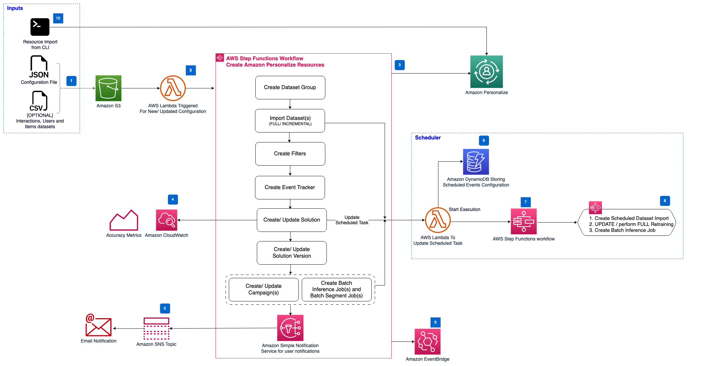

# Maintaining Personalized Experiences with Machine Learning

The Maintaining Personalized Experiences with Machine Learning solution provides a mechanism to automate much of the
workflow around Amazon Personalize. This includes dataset group creation, dataset creation and import, solution
creation, solution version creation, campaign creation and batch inference job creation

Scheduled rules can be configured for setting up import jobs, solution version retraining (with campaign update) and
batch inference job creation.

## Table of Contents

- [Architecture for the AWS MLOps for Amazon Personalize Solution](#architecture)
- [AWS CDK Constructs](#aws-cdk-constructs)
- [Deployment](#deployment)
- [Creating a custom build](#creating-a-custom-build)
- [Collection of operational metrics](#collection-of-operational-metrics)

## Architecture

The following describes the architecture of the solution



The AWS CloudFormation template deploys the resources required to automate your Amazon Personalize usage and deployments.
The template includes the following components:

1. An Amazon S3 bucket used to store personalization data and configuration files.
2. An AWS Lambda function triggered when new/ updated personalization configuration is uploaded to the personalization data bucket.
3. An AWS Stepfunctions workflow to manage all of the resources of an Amazon Personalize dataset group (including datasets, schemas, event tracker, filters, solutions, campaigns, and batch inference jobs).
4. Amazon CloudWatch metrics for Amazon Personalize for each new trained solution version are added to help you evaluate the performance of a model over time.
5. An Amazon Simple Notification Service (SNS) topic and subscription to notify an administrator when the maintenance workflow has completed via email.
6. Amazon DynamoDB is used to track the scheduled events configured for Amazon Personalize to fully or partially retrain solutions, (re) import datasets and perform batch inference jobs.
7. An AWS Stepfunctions workflow is used to track the current running scheduled events, and invokes step functions to perform solution maintenance (creating new solution versions, updating campaigns), import updated datasets, and perform batch inference.
8. A set of maintenance AWS Stepfunctions workflows are provided to:
   1. Create new dataset import jobs on schedule
   2. Perform solution FULL retraining on schedule (and update associated campaigns)
   3. Perform solution UPDATE retraining on schedule (and update associated campaigns)
   4. Create batch inference jobs
9. An Amazon EventBridge event bus, where resource status notification updates are posted throughout the AWS Step
   functions workflow
10. A command line interface (CLI) lets existing resources be imported and allows schedules to be established for
    resources that already exist in Amazon Personalize

> **Note**: From v1.0.0, AWS CloudFormation template resources are created by the [AWS CDK](https://aws.amazon.com/cdk/)
> and [AWS Solutions Constructs](https://aws.amazon.com/solutions/constructs/).

### AWS CDK Constructs

[AWS CDK Solutions Constructs](https://aws.amazon.com/solutions/constructs/) make it easier to consistently create
well-architected applications. All AWS Solutions Constructs are reviewed by AWS and use best practices established by
the AWS Well-Architected Framework. This solution uses the following AWS CDK Solutions Constructs:

- [aws-lambda-sns](https://docs.aws.amazon.com/solutions/latest/constructs/aws-lambda-sns.html)

## Deployment

You can launch this solution with one click from [AWS Solutions Implementations](https://aws.amazon.com/solutions/implementations/maintaining-personalized-experiences-with-ml).

To customize the solution, or to contribute to the solution, see [Creating a custom build](#creating-a-custom-build)

## Configuration

This solution uses **parameter files**. The parameter file contains all the necessary information to create and maintain
your resources in Amazon Personalize.

The file can contain the following sections

- `datasetGroup`
- `datasets`
- `solutions` (can contain `campaigns` and `batchInferenceJobs`)
- `eventTracker`
- `filters`

<details>
<summary>See a sample of the parameter file</summary>

```json
{
	"datasetGroup": {
		"serviceConfig": {
			"name": "dataset-group-name-1"
		},
		"workflowConfig": {
			"schedules": {
				"import": "cron(0 */6 * * ? *)"
			}
		}
	},
	"datasets": {
		"users": {
			"dataset": {
				"serviceConfig": {
					"name": "users-data"
				}
			},
			"schema": {
				"serviceConfig": {
					"name": "users-schema",
					"schema": {
						"type": "record",
						"name": "users",
						"namespace": "com.amazonaws.personalize.schema",
						"fields": [
							{
								"name": "USER_ID",
								"type": "string"
							},
							{
								"name": "AGE",
								"type": "int"
							},
							{
								"name": "GENDER",
								"type": "string",
								"categorical": true
							}
						]
					}
				}
			}
		},
		"interactions": {
			"dataset": {
				"serviceConfig": {
					"name": "interactions-data"
				}
			},
			"schema": {
				"serviceConfig": {
					"name": "interactions-schema",
					"schema": {
						"type": "record",
						"name": "interactions",
						"namespace": "com.amazonaws.personalize.schema",
						"fields": [
							{
								"name": "ITEM_ID",
								"type": "string"
							},
							{
								"name": "USER_ID",
								"type": "string"
							},
							{
								"name": "TIMESTAMP",
								"type": "long"
							},
							{
								"name": "EVENT_TYPE",
								"type": "string"
							},
							{
								"name": "EVENT_VALUE",
								"type": "float"
							}
						]
					}
				}
			}
		}
	},
	"solutions": [
		{
			"serviceConfig": {
				"name": "sims-solution",
				"recipeArn": "arn:aws:personalize:::recipe/aws-sims"
			},
			"workflowConfig": {
				"schedules": {
					"full": "cron(0 0 ? * 1 *)"
				}
			}
		},
		{
			"serviceConfig": {
				"name": "popularity-count-solution",
				"recipeArn": "arn:aws:personalize:::recipe/aws-popularity-count"
			},
			"workflowConfig": {
				"schedules": {
					"full": "cron(0 1 ? * 1 *)"
				}
			}
		},
		{
			"serviceConfig": {
				"name": "user-personalization-solution",
				"recipeArn": "arn:aws:personalize:::recipe/aws-user-personalization"
			},
			"workflowConfig": {
				"schedules": {
					"full": "cron(0 2 ? * 1 *)"
				}
			},
			"campaigns": [
				{
					"serviceConfig": {
						"name": "user-personalization-campaign",
						"minProvisionedTPS": 1
					}
				}
			],
			"batchInferenceJobs": [
				{
					"serviceConfig": {},
					"workflowConfig": {
						"schedule": "cron(0 3 * * ? *)"
					}
				}
			]
		}
	],
	"eventTracker": {
		"serviceConfig": {
			"name": "dataset-group-name-event-tracker"
		}
	},
	"filters": [
		{
			"serviceConfig": {
				"name": "clicked-or-streamed",
				"filterExpression": "INCLUDE ItemID WHERE Interactions.EVENT_TYPE in (\"click\", \"stream\")"
			}
		},
		{
			"serviceConfig": {
				"name": "interacted",
				"filterExpression": "INCLUDE ItemID WHERE Interactions.EVENT_TYPE in (\"*\")"
			}
		}
	]
}
```

</details>

This solution allows you to manage multiple dataset groups through the use of multiple parameter files. All .json files
discovered under the `train/` prefix will trigger the workflow however, the following structure is recommended:

```
train/
│
├── <dataset_group_1>/ (option 1 - single csv files for data import)
│   ├── config.json
│   ├── interactions.csv
│   ├── items.csv (optional)
│   └── users.csv (optional)
│
└── <dataset_group_2>/ (option 2 - multiple csv files for data import)
    ├── config.json
    ├── interactions/
    │   ├── <interactions_part_1>.csv
    │   ├── <interactions_part_2>.csv
    │   └── <interactions_part_n>.csv
    ├── users/ (optional)
    │   ├── <users_part_1>.csv
    │   ├── <users_part_2>.csv
    │   └── <users_part_n>.csv
    └── items/ (optional)
        ├── <items_part_1>.csv
        ├── <items_part_2>.csv
        └── <items_part_n>.csv
```

If batch inference jobs are required, [batch inference job configuration files](https://docs.aws.amazon.com/personalize/latest/dg/recommendations-batch.html#batch-data-upload)
must also be uploaded to the following lcoation:

```
batch/
│
└── <dataset_group_name>/
    └── <solution_name>/
        └── job_config.json
```

Batch inference output will be produced at the following location:

```
batch/
│
└── <dataset_group_name>/
    └── <solution_name>/
        └── <solution_name_YYYY_MM_DD_HH_MM_SS>/
            ├── _CHECK
            └── job_config.json.out
```

Note: It is not recommended to use `performAutoML` as this feature will be deprecated in the future. Please take the time to select the most appropriate recipe for your use-case. If this parameter is used for this solution in the configuration, it will log an error and continue to build the solution without it. Please refer [FAQs](https://github.com/aws-samples/amazon-personalize-samples/blob/master/PersonalizeCheatSheet2.0.md) and [AWS Personalize Developer Guide](https://docs.aws.amazon.com/personalize/latest/dg/API_CreateSolution.html#personalize-CreateSolution-request-performAutoML).

## Configuration with Tags

You can also optionally supply tags in your configurations:

```json
{
	"datasetGroup": {
		"serviceConfig": {
			"name": "dataset-group-name-2",
			"tags": [
				{
					"tagKey": "dataset-group-key",
					"tagValue": "dataset-group-value"
				}
			]
		}
	},
	"datasets": {
		"serviceConfig": {
			"importMode": "FULL",
			"tags": [
				{
					"tagKey": "datasets-key",
					"tagValue": "datasets-value"
				}
			]
		},
		"interactions": {
			"dataset": {
				"serviceConfig": {
					"name": "interactions-data",
					"tags": [
						{
							"tagKey": "interactions-dataset-key",
							"tagValue": "interactions-dataset-value"
						}
					]
				}
			},
			"schema": {
				"serviceConfig": {
					"name": "interactions-schema",
					"schema": {
						"type": "record",
						"name": "Interactions",
						"namespace": "com.amazonaws.personalize.schema",
						"fields": [
							{
								"name": "USER_ID",
								"type": "string"
							},
							{
								"name": "ITEM_ID",
								"type": "string"
							},
							{
								"name": "TIMESTAMP",
								"type": "long"
							},
							{
								"name": "EVENT_TYPE",
								"type": "string"
							}
						],
						"version": "1.0"
					}
				}
			}
		},
		"items": {
			"dataset": {
				"serviceConfig": {
					"name": "items-data",
					"tags": [
						{
							"tagKey": "items-dataset-key",
							"tagValue": "items-dataset-value"
						}
					]
				}
			},
			"schema": {
				"serviceConfig": {
					"name": "items-schema",
					"schema": {
						"type": "record",
						"name": "Items",
						"namespace": "com.amazonaws.personalize.schema",
						"fields": [
							{
								"name": "ITEM_ID",
								"type": "string"
							},
							{
								"name": "GENRES",
								"type": "string",
								"categorical": true
							},
							{
								"name": "YEAR",
								"type": "int"
							},
							{
								"name": "CREATION_TIMESTAMP",
								"type": "long"
							}
						],
						"version": "1.0"
					}
				}
			}
		},
		"users": {
			"dataset": {
				"serviceConfig": {
					"name": "users-data",
					"tags": [
						{
							"tagKey": "users-dataset-key",
							"tagValue": "users-dataset-value"
						}
					]
				}
			},
			"schema": {
				"serviceConfig": {
					"name": "users-schema",
					"schema": {
						"type": "record",
						"name": "Users",
						"namespace": "com.amazonaws.personalize.schema",
						"fields": [
							{
								"name": "USER_ID",
								"type": "string"
							},
							{
								"name": "GENDER",
								"type": "string",
								"categorical": true
							}
						],
						"version": "1.0"
					}
				}
			}
		}
	},
	"eventTracker": {
		"serviceConfig": {
			"name": "event-tracker-name",
			"tags": [
				{
					"tagKey": "event-tracker-key",
					"tagValue": "event-tracker-value"
				}
			]
		}
	},
	"solutions": [
		{
			"serviceConfig": {
				"name": "solution-recommender-user-personalization",
				"recipeArn": "arn:aws:personalize:::recipe/aws-user-personalization",
				"performHPO": true,
				"tags": [
					{
						"tagKey": "solution-key",
						"tagValue": "solution-value"
					}
				],
				"solutionVersion": {
					"name": "solutionV1",
					"trainingMode": "FULL",
					"tags": [
						{
							"tagKey": "solution-version-key",
							"tagValue": "solution-version-value"
						}
					]
				}
			}
		}
	]
}
```

Note: You cannot tag already created resources through the configuration. Only "FULL" `importMode` for datasets is currently supported.

Tags can also be root-level tags and they apply to all components which do not have tags specified. For example, for the datasetGroup `dataset-group-name-3` specified below, `tagKey` "project" and `tagValue` "user-personalization" applies to `datasetGroup`, `interactions` dataset and its import, the `eventTracker`, and the `solutionVersion`, but the dataset-import gets the specified values for tagKey and tagValue as "datasets-key" and "datasets-value" respectively (applies for dataset imports of users, interactions and items datasets) and solution `solution-user-personalization` gets "solution-key" and "solution-value":

```json
{
	"tags": [
		{
			"tagKey": "project",
			"tagValue": "user-personalization"
		}
	],
	"datasetGroup": {
		"serviceConfig": {
			"name": "dataset-group-name-3"
		}
	},
	"datasets": {
		"serviceConfig": {
			"importMode": "FULL",
			"tags": [
				{
					"tagKey": "datasets-key",
					"tagValue": "datasets-value"
				}
			]
		},
		"interactions": {
			"dataset": {
				"serviceConfig": {
					"name": "interactions-data"
				}
			},
			"schema": {
				"serviceConfig": {
					"name": "interactions-schema",
					"schema": {
						"type": "record",
						"name": "Interactions",
						"namespace": "com.amazonaws.personalize.schema",
						"fields": [
							{
								"name": "USER_ID",
								"type": "string"
							},
							{
								"name": "ITEM_ID",
								"type": "string"
							},
							{
								"name": "TIMESTAMP",
								"type": "long"
							},
							{
								"name": "EVENT_TYPE",
								"type": "string"
							}
						],
						"version": "1.0"
					}
				}
			}
		}
	},
	"eventTracker": {
		"serviceConfig": {
			"name": "event-tracker-name"
		}
	},
	"solutions": [
		{
			"serviceConfig": {
				"name": "solution-user-personalization",
				"recipeArn": "arn:aws:personalize:::recipe/aws-user-personalization",
				"performHPO": true,
				"tags": [
					{
						"tagKey": "solution-key",
						"tagValue": "solution-value"
					}
				]
			}
		}
	]
}
```

Some key points:

1. Solution version tags can be specified inside the solution's `serviceConfig` field, inside the `solutionVersion` field (see the `dataset-group-name-2` example). `solutionVersion` specification is optional.
2. Root-level tags apply to all components which do not have explicit tags specified (see notes around `dataset-group-name-2` json example).
3. [`tags`](https://docs.aws.amazon.com/personalize/latest/dg/tagging-resources.html) are optional fields.

## Training Mode

Training mode can be described as 'FULL' or 'UPDATE' through the `solutionVersion` field inside the `solution` specification.

The purpose of trainingMode="UPDATE" is to process new items added to the items dataset (via PutItems or a bulk upload) as well as impression data for new interactions added to the interactions since the last FULL/UPDATE training. The UPDATE mode only brings in new items and impression data and does not retrain the model. Therefore, if there are no dataset updates since the last FULL/UPDATE training, you might get an error saying "There should be updates to at least one dataset after last active solution version with training mode set to FULL".

With User-Personalization, Amazon Personalize automatically updates the latest model (solution version) every two hours behind the scenes to include new data. There is no cost for automatic updates. The solution version must be deployed with an [Amazon Personalize campaign](https://docs.aws.amazon.com/personalize/latest/dg/campaigns.html) for updates to occur. Your campaign automatically uses the updated solution version. No new solution version is created when an auto update completes and no new model metrics are generated. This is because no full retraining occurs. If you create a new solution version, Amazon Personalize will not automatically update older solution versions, even if you have deployed them in a campaign. Updates also do not occur if you have deleted your dataset.

If every two hours is not frequent enough, you can manually create a solution version with trainingMode set to UPDATE to include those new items in recommendations. Amazon Personalize automatically updates only your latest fully trained solution version, so the manually updated solution version won't be automatically updated in the future. Also note that if you create a solution version with UPDATE, you will be charged for the server hours to perform the update.

For more information about automatic updates, see the [Amazon Personalize Developer Guide](https://docs.aws.amazon.com/personalize/latest/dg/native-recipe-new-item-USER_PERSONALIZATION.html#automatic-updates)

```json
...
"solutions": [
    {
      "serviceConfig": {
        "name": "affinity_item",
        "recipeArn": "arn:aws:personalize:::recipe/aws-item-affinity",
        "solutionVersion": {
          "trainingMode": "UPDATE"
		  "tags": [{"tagKey": "project", "tagValue": "item-affinity"}]
        }
      },
      ...
	}
]
...

```

## Creating a custom build

To customize the solution, follow the steps below:

### Prerequisites

The following procedures assumes that all the OS-level configuration has been completed. They are:

- [AWS Command Line Interface](https://aws.amazon.com/cli/)
- [Python](https://www.python.org/) 3.9 or newer
- [Node.js](https://nodejs.org/en/) 16.x or newer
- [AWS CDK](https://aws.amazon.com/cdk/) 2.75.0 or newer
- [Amazon Corretto OpenJDK](https://docs.aws.amazon.com/corretto/) 17.0.4.1

> **Please ensure you test the templates before updating any production deployments.**

### 1. Download or clone this repo

```

git clone https://github.com/aws-solutions/maintaining-personalized-experiences-with-machine-learning

```

### 2. Create a Python virtual environment for development

```bash
python -m virtualenv .venv
source ./.venv/bin/activate
cd ./source
pip install -r requirements-dev.txt
```

### 2. After introducing changes, run the unit tests to make sure the customizations don't break existing functionality

```bash
pytest --cov
```

### 3. Build the solution for deployment

#### Using AWS CDK (recommended)

Packaging and deploying the solution with the AWS CDK allows for the most flexibility in development

```bash
cd ./source/infrastructure

# set environment variables required by the solution
export BUCKET_NAME="my-bucket-name"

# bootstrap CDK (required once - deploys a CDK bootstrap CloudFormation stack for assets)
cdk bootstrap --cloudformation-execution-policies arn:aws:iam::aws:policy/AdministratorAccess

# build the solution
cdk synth

# build and deploy the solution
cdk deploy
```

#### Using the solution build tools

It is highly recommended to use the AWS CDK to deploy this solution (using the instructions above). While CDK is used to
develop the solution, to package the solution for release as a CloudFormation template, use the `build-s3-cdk-dist`
build tool:

```bash
cd ./deployment

export DIST_BUCKET_PREFIX=my-bucket-name
export SOLUTION_NAME=my-solution-name
export VERSION=my-version
export REGION_NAME=my-region

build-s3-cdk-dist deploy \
  --source-bucket-name $DIST_BUCKET_PREFIX \
  --solution-name $SOLUTION_NAME \
  --version_code $VERSION \
  --cdk-app-path ../source/infrastructure/deploy.py \
  --cdk-app-entrypoint deploy:build_app \
  --region $REGION_NAME \
  --sync
```

**Parameter Details**

- `$DIST_BUCKET_PREFIX` - The S3 bucket name prefix. A randomized value is recommended. You will need to create an
  S3 bucket where the name is `<DIST_BUCKET_PREFIX>-<REGION_NAME>`. The solution's CloudFormation template will expect the
  source code to be located in the bucket matching that name.
- `$SOLUTION_NAME` - The name of This solution (example: personalize-solution-customization)
- `$VERSION` - The version number to use (example: v0.0.1)
- `$REGION_NAME` - The region name to use (example: us-east-1)

This will result in all global assets being pushed to the `DIST_BUCKET_PREFIX`, and all regional assets being pushed to
`DIST_BUCKET_PREFIX-<REGION_NAME>`. If your `REGION_NAME` is us-east-1, and the `DIST_BUCKET_PREFIX` is
`my-bucket-name`, ensure that both `my-bucket-name` and `my-bucket-name-us-east-1` exist and are owned by you.

After running the command, you can deploy the template:

- Get the link of the `SOLUTION_NAME.template` uploaded to your Amazon S3 bucket
- Deploy the solution to your account by launching a new AWS CloudFormation stack using the link of the template above.

> **Note:** `build-s3-cdk-dist` will use your current configured `AWS_REGION` and `AWS_PROFILE`. To set your defaults,
> install the [AWS Command Line Interface](https://aws.amazon.com/cli/) and run `aws configure`.

## Collection of operational metrics

This solution collects anonymous operational metrics to help AWS improve the quality of features of the solution.
For more information, including how to disable this capability, please see the [implementation guide](https://docs.aws.amazon.com/solutions/latest/maintaining-personalized-experiences-with-ml/collection-of-operational-metrics.html).

---

Copyright Amazon.com, Inc. or its affiliates. All Rights Reserved.

Licensed under the Apache License, Version 2.0 (the "License");
you may not use this file except in compliance with the License.
You may obtain a copy of the License at

    http://www.apache.org/licenses/LICENSE-2.0

Unless required by applicable law or agreed to in writing, software
distributed under the License is distributed on an "AS IS" BASIS,
WITHOUT WARRANTIES OR CONDITIONS OF ANY KIND, either express or implied.
See the License for the specific language governing permissions and
limitations under the License.
